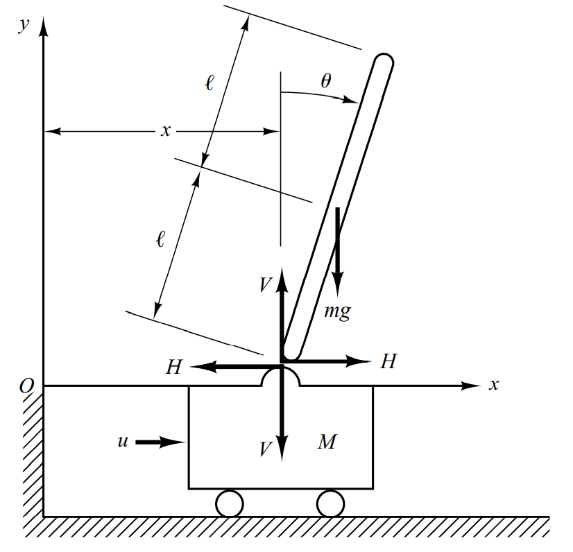
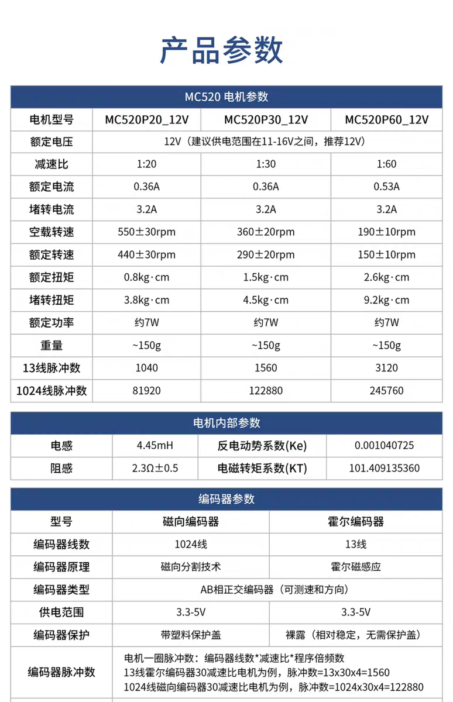

# self_balanced_robot
LQR控制算法在两轮自平衡小车的实践

## 经典倒立摆模型

[倒立摆控制-CSDN博客](https://blog.csdn.net/qq_42731705/article/details/122464642)提供了详细的倒立摆动力学模型推导过程。本文取逆时针旋转为正方向（即：上图摆杆摆角小于0），动力学模型如下：
$$
\begin{bmatrix}
    \dot{x} \\
    \ddot{x} \\
    \dot{\phi} \\
    \ddot{\phi}
\end{bmatrix}
    = 
\begin{bmatrix}
    0 & 1                        & 0                                             & 0 \\
    0 & 0                        & \dfrac{m^{2}gl^{2}}{I(M + m) + M m l^{2}}     & 0 \\
    0 & 0                        & 0                                             & 1 \\
    0 & 0                        & \dfrac{mgl(M + m)}{I(M + m) + M m l^{2}}      & 0 
\end{bmatrix}
\begin{bmatrix}
    x \\
    \dot{x} \\
    \phi \\
    \dot{\phi}
\end{bmatrix}
+
\begin{bmatrix}
    0 \\
    \dfrac{I + ml^{2}}{I(M + m) + M m l^{2}} \\
    0 \\
    \dfrac{ml}{I(M + m) + M m l^{2}}
\end{bmatrix}
u
$$

$$
y = 
\begin{bmatrix}
    1 & 0 & 0 & 0 \\
    0 & 0 & 1 & 0
\end{bmatrix}
\begin{bmatrix}
    x \\
    \dot{x} \\
    \phi \\
    \dot{\phi}
\end{bmatrix}
$$

其中：$l$表示摆杆重心到铰链的距离，$I$表示摆杆以铰链为旋转轴的惯量

## 两轮自平衡小车动力学模型

### 轮子摩擦力和电机PWM关系

自平衡小车和经典倒立摆不完全相同，最大的差异在于：自平衡小车没有推力$u$，它的推力实际来自于地面对轮子的滚动摩擦力，而滚动摩擦来自于电机转矩。直流电机转矩由电压确定，电压大小由PWM占空比来决定。因此，有必要建立滚动摩擦力和电机PWM占空比的表达式。

直流电机的输出转矩$\tau_m$和角速度$\omega$、外加电压$V_a$存在以下关系：
$$
\tau_m=\frac{-k_mk_e}{R}\omega+\frac{k_m}{R}V_a
$$
其中$k_m$表示电机转矩常数、$k_e $表示电机反电动势常数、$R$表示电机电阻，都是常数

对电机轴应用刚体转动定律，电机的输出转矩$\tau_m$和负载转矩$\tau_a$、角加速度$\dot{\omega}$存在以下关系：
$$
I_R\dot{\omega}=\tau_m-\tau_a
$$
代换后得到：
$$
\tau_a=-I_R\dot{\omega}+\frac{-k_mk_e}{R}\omega+\frac{k_m}{R}V_a
$$
对轮子应用刚体转动定律：
$$
I_W\dot{\omega}=\tau_a-H_fr
$$
其中，$I_W$表示轮子转动惯量，$H_f$表示地面的静摩擦力，$r$表示轮子半径。（在这里近似认为电机输出转矩全部传递给轮子，忽略电机传动过程中轴承齿轮摩擦力形成的转矩）

代换后得到：
$$
H_f=\frac{1}{r}(-I_W\dot{\omega}-I_R\dot{\omega}+\frac{-k_mk_e}{R}\omega+\frac{k_m}{R}V_a)
$$
电机电压和pwm占空比存在比例关系：
$$
V_a=V_{amax}D_{pwm}
$$
因此，最终得到轮子滚动摩擦力和电机PWM占空比关系为：
$$
H_f=\frac{1}{r}(-I_W\dot{\omega}-I_R\dot{\omega}+\frac{-k_mk_e}{R}\omega+\frac{k_mV_{amax}}{R}D_{pwm})
$$
（参考资料：[Balancing a Two-Wheeled   Autonomous Robot](https://www.cs.cmu.edu/~mmcnaugh/kdc/as7/2003-Balance-Ooi.pdf)）

电机MC520P30_12V手册：

根据堵转电流计算电机电阻$R=\frac{12}{3.75}=3.2$和内参基本符合，按内参取$R=2.8$

根据额定转矩和额定电流计算转矩常数$k_{m}=\frac{1.5/100}{0.36}=0.04167$，内参转矩常数考虑减速比后$k_{m}=101.41\times10^{-5}\times30=0.030423$，按内参取

根据额点电流和额定转速计算反电动势常数$k_e=\frac{12-0.36\times2.8}{290\times\pi/30}=0.3620$，内参单位看不出来

带入电机参数得：
$$
\frac{-k_mk_e}{R}=-0.003933 \\
\frac{k_mV_{amax}}{R}=0.13038
$$

### 转动惯量辨识

通过空载测试进行辨识。空载时摩擦力为0，此时：
$$
\dot{\omega}=\frac{1}{I_W+I_R}(\frac{-k_mk_e}{R}\omega+\frac{k_mV_{amax}}{R}D_{pwm})
$$

计算后取：
$$
I_W+I_R=0.00016
$$

## Matlab求解LQR反馈矩阵K

见matlab源程序

## 实际部署效果

[演示视频1](./assets/VID.mp4)

[演示视频2](./assets/VID1.mp4)
